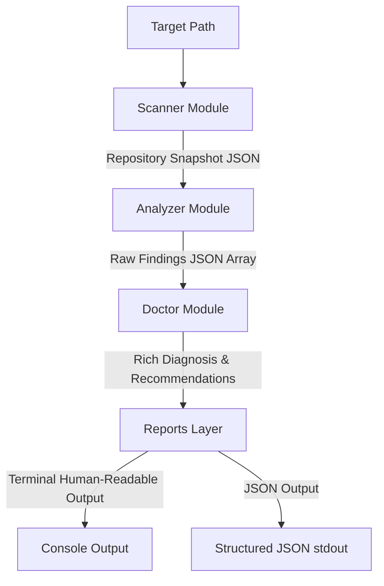

# RepoDoctor

RepoDoctor is a fast, offline, and zero-dependency repository health and diagnostics CLI utility. It scans local projects (specifically targeting Node.js environments) to analyze structure, Git configurations, dependencies, and project metadata, offering detailed diagnostic findings and recommendations to fix issues.

Designed for simplicity, portability, and performance, RepoDoctor is written purely in Node.js using only standard library APIs, guaranteeing zero third-party runtime or development dependencies.

---

## Hackathon Track A Compliance

RepoDoctor is custom-built to be fully compliant with **Hackathon Track A Constraints**:
- **Zero Third-Party Dependencies**: The application does not use external libraries (e.g., `chalk`, `commander`, `lodash`, or `jest`). Both production and development modules rely exclusively on modern built-in Node.js libraries.
- **Pure Offline Operation**: All calculations, directory traversal operations, and Git analyses run locally on the client system. No external network connections, socket integrations, or remote API calls are executed.
- **Fast and Instant Run**: No installation (`npm install`) is required, making setup immediate, memory-safe, and secure.

---

## System Architecture

RepoDoctor is architected around a linear diagnostics pipeline:



1. **CLI Parser & Dispatcher**: Parses CLI arguments and handles commands via portable launchers.
2. **Scanner (`src/scanner/`)**: Performs recursive directory traversal. Collects directory layout, file metrics, standard project configuration existence, Git commits, configurations, and uncommitted edits. Safe against symbolic link cycles.
3. **Analyzer (`src/analyzer/`)**: Evaluates the scanner snapshot against built-in diagnostic rules (e.g. detecting duplicate package dependencies, missing configuration files, malformed manifest JSON).
4. **Doctor (`src/doctor/`)**: Translates raw analyzer findings into informative diagnoses detailing severity, category, why the finding matters, and actionable Recommendations.
5. **Reports Layer (`src/reports/`)**: Standardizes rendering using abstract report engines. Formats results into ANSI-colored terminal summaries or output-pure JSON streams.

---

## What Problem it Solves

When starting a project or reviewing code repositories, developers frequently encounter basic structural inconsistencies, missing core configurations, or duplicate package declarations in `package.json` that complicate build stability and setup.

RepoDoctor automates checking for these issues locally and immediately, without needing heavy third-party linters, external cloud integrations, or an active internet connection.

---

## Key Features & Scope

- **Pure Offline Fact Collection**: Resolves file entries, sizes, configurations, and Git details locally.
- **Git Workspace Integrity**: Detects uncommitted local changes and verifies `.gitignore` presence.
- **Dependency Diagnostics**: Highlights duplicate declaration conflicts (e.g. packages defined in both `dependencies` and `devDependencies` or `peerDependencies` inside `package.json`).
- **Malformed manifest validation**: Safely parses `package.json` and exposes syntax or formatting errors natively.
- **Zero Third-Party Code**: Guarantees compliance with zero external dependencies. No libraries like `chalk`, `commander`, `lodash`, or `jest` are used.

---

## How to Run RepoDoctor

RepoDoctor is executable using Node.js directly or via platform launchers.

### Direct Node Invocation
```bash
node src/main.js [options] [command] [path]
```

### Windows Launcher
```powershell
.\repodoctor.cmd [options] [command] [path]
```

### Unix-like Shell Launcher
```bash
./repodoctor [options] [command] [path]
```

*Note: You may need to grant execution permissions to the shell script first using `chmod +x repodoctor`.*

---

## Available Commands

- **`scan`**: Traverses the targeted path to collect facts, returning a raw `RepositorySnapshot` JSON structure.
- **`check`**: Runs diagnostic rules on the collected snapshot facts and prints any issues in JSON array format.
- **`doctor`**: Compiles a human-readable diagnostics report detailing severity, categories, why findings matter, and specific recommendation guides.
- **`(default)`**: Runs the default entry dispatcher if no command is specified (e.g. `repodoctor .`).

---

## Available Options

- **`-h, --help`**: Shows help documentation and exits with code `0`.
- **`-v, --version`**: Shows the application version and exits with code `0`.
- **`--verbose`**: Outputs detailed processing details and full error stack traces on failures.
- **`-j, --json`**: Outputs findings in structured JSON format (supported on the `doctor` command).

---

## Example Usage and Outputs

### 1. Doctor Command (Standard Human-Readable Format)
```bash
node src/main.js doctor .
```

**Output:**
```text
RepoDoctor
──────────────────────────
Repository: repodoctor

Findings
──────────────────────────
[WARNING] Missing .gitignore file
Category: git

Why:
A .gitignore file prevents untracked files like build artifacts, sensitive keys, or dependencies (e.g. node_modules) from being committed to Git.

Recommendation:
Add a .gitignore file to the root of the repository. Include patterns appropriate for the project's language and build tooling (e.g. node_modules/, dist/, .env, *.log). A .gitignore generator or template can help identify common entries.

──────────────────────────
[INFO] Uncommitted changes in repository
Category: git

Why:
Uncommitted files leave the repository in a transient state, making it hard to track exact code versions or clean builds.

Recommendation:
Review the uncommitted changes in the working directory. Either commit relevant changes with a descriptive message (git add . && git commit -m "..."), or discard changes that are not intended (git checkout -- <file> or git clean -fd for untracked files).

──────────────────────────
2 findings
```

### 2. Doctor Command with JSON Output
```bash
node src/main.js doctor --json .
```

**Output:**
```json
{
  "repository": "repodoctor",
  "findings": [
    {
      "id": "missing-gitignore",
      "category": "git",
      "severity": "warning",
      "title": "Missing .gitignore file",
      "description": "The directory is a Git repository but does not contain a .gitignore file at the root.",
      "evidence": {
        "isRepo": true,
        "gitignorePresent": false
      },
      "location": null
    }
  ],
  "entries": [
    {
      "finding": {
        "id": "missing-gitignore",
        "category": "git",
        "severity": "warning",
        "title": "Missing .gitignore file",
        "description": "The directory is a Git repository but does not contain a .gitignore file at the root.",
        "evidence": {
          "isRepo": true,
          "gitignorePresent": false
        },
        "location": null
      },
      "diagnosis": {
        "problem": "The directory is a Git repository but does not contain a .gitignore file at the root.",
        "why": "A .gitignore file prevents untracked files like build artifacts, sensitive keys, or dependencies (e.g. node_modules) from being committed to Git.",
        "evidence": "gitignorePresent is false."
      },
      "recommendation": "Add a .gitignore file to the root of the repository. Include patterns appropriate for the project's language and build tooling (e.g. node_modules/, dist/, .env, *.log). A .gitignore generator or template can help identify common entries."
    }
  ],
  "summary": {
    "total": 1,
    "bySeverity": {
      "critical": 0,
      "error": 0,
      "warning": 1,
      "info": 0
    }
  }
}
```

---

## Exit Codes Contract

RepoDoctor implements clear, predictable exit codes:

| Code | Name | Description |
| :--- | :--- | :--- |
| `0` | `SUCCESS` | Diagnostics ran successfully and **zero** issues were found. |
| `1` | `FINDINGS` | Diagnostics ran successfully but **one or more** issues/findings were detected. |
| `2` | `USAGE_ERROR` | Syntax error in CLI arguments, options, or flags. |
| `3` | `IO_ERROR` | Filesystem I/O error (e.g., target directory does not exist, or path is a file). |
| `4` | `INTERNAL_ERROR` | An unexpected application failure occurred. |

---

## Zero-Dependency Architecture

RepoDoctor is built using strictly native modules provided by the Node.js runtime:
- `node:fs` / `node:fs/promises`: Filesystem checks and directory traversal.
- `node:path`: Portable file path normalisation.
- `node:child_process`: Executing local CLI tasks (e.g., git status queries).
- `node:url` / `node:os`: Metadata facts.
- `node:test` / `node:assert`: Running and evaluating the built-in test suites.

---

## Limitations

- **No Online Vulnerability Auditing**: RepoDoctor works completely offline. It does not check database platforms (such as npm audit, Snyk, or CVE databases) for package vulnerabilities.
- **No Automated Fixes**: The CLI functions exclusively in **read-only** mode. It does not modify local files, write configurations, format source code, or run installation tasks.
- **No AI Integrations**: Recommendations are generated using local, deterministic rules, ensuring privacy, speed, and reliability.

---

## Development & Test Suite Instructions

### Node.js Engine Requirements
RepoDoctor requires **Node.js Engine >= 18.0.0** to run, compile facts, and run diagnostics due to utilizing modern built-in ES modules (`import`/`export`) and native Node.js test suites.

### Testing Execution Commands
Since executing terminal script wrappers via `npm` might be blocked by default PowerShell environment security execution policies on Windows, developers can run the entire test suite directly using the native Node.js engine:

```bash
node --test tests/analyzer/analyzer.test.js tests/analyzer/safety.test.js tests/cli/cli.test.js tests/cli/exit_codes.test.js tests/cli/integration.test.js tests/cli/parser.test.js tests/doctor/doctor.test.js tests/reports/json.test.js tests/reports/report.test.js tests/reports/terminal.test.js tests/scanner/safety.test.js tests/scanner/scanner.test.js
```

*(Alternatively, if script running policies allow npm executables or in simple shell environments, you may run `npm test`.)*
